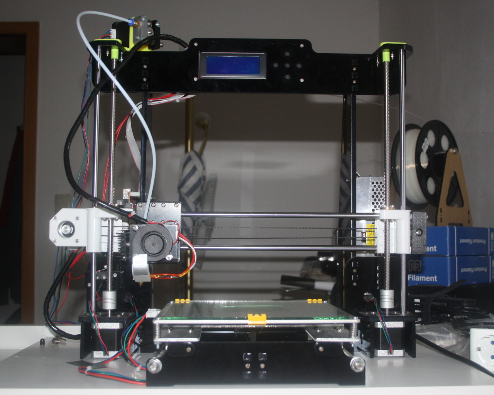
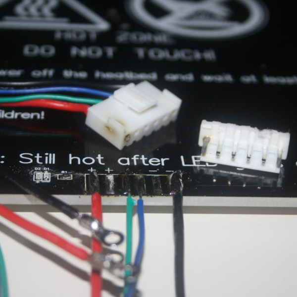
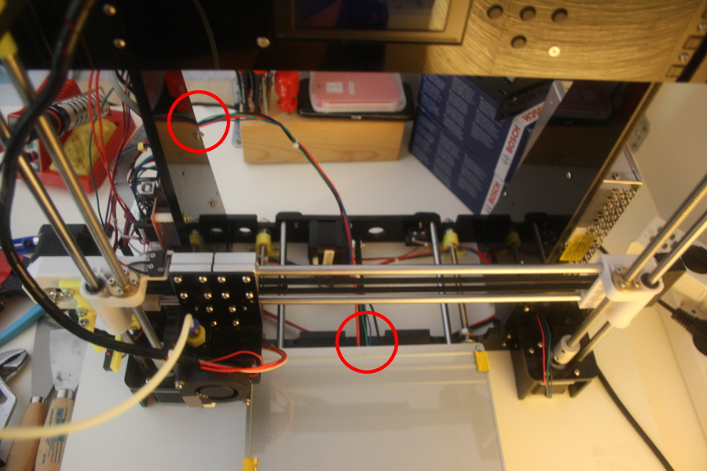

# Anet A8 Upgrade Tutorial

This repository contains all necessary upgrades for the
Anet A8 to increase its printing quality, sorted by
priority and in a form of a step-by-step-for-noobs
guide as it was a bit hard to find all the things on
the interwebz for me.

Hopefully this guide can help others upgrading their
Anet A8 and ease up the process.


## TL;DR Parts List

This is the third-party parts list that you will
need to buy to do all upgrades explained below

- 2mm/4mm PTFE (teflon) tube (min. 50cm length)
- 2.5mm GT2 timing belts (min. 200cm length)
- 2x 4mm pneumatic adapter (tube feed)
- 2x NEMA 17 stepper motors

Note: The PTFE tube needs to have inner diameter
of 2mm and outer diameter of 4mm. If you want to
use bigger filament diameters, change the pneumatic
adapter sizes accordingly.

Important: The Z-Axis stepper motors should be
replaced with stronger 17-ones, as many users
(including me) had troubles with a stuck Z-axis
motor driver that was too weak to liften the
X-carriage.


## Step-By-Step Guide

This Guide can be followed after you've already
assembled your Anet A8 3D printer.

The [installation instructions](./instructions/installation-instructions.pdf)
are also available.

The Anet A8 is delivered with varying power supplies.
If you are unsure on how to connect it, compare your
power supply with [this photo](./instructions/power-supply.jpg).

The mainboard's schematics are also available at
[this picture](./instructions/mainboard.jpg).

**IMPORTANT**: The connectors for the power cables
of the heatbed and extruder on the mainboard are of bad
quality, it is important that you connect the cables with
some space to the insulation. Otherwise your cable
insulation will overheat and burn down.

The [printing quality troubleshooting guide](./instructions/quality-troubleshooting-guide.pdf)
is also available in case some prints are deformed or broken.


----------

**1: Belt Tensioners, Belt Holders, GT2 Belts and Z-Wobble Fixes**


If you can't use another printer, print these parts and
immediately upgrade the Anet A8 afterwards, so that later
prints will have a better quality.

- Print the [x-belt holder](./parts/belt-holders/x-belt_holder.stl) 1 time.
- Print the y-belt holder [top](./parts/belt-holders/y-belt_holder-top.stl) and [bottom](./parts/belt-holders/y-belt_holder-bottom.stl) each 1 time.
- Print the [x-belt tensioner](./parts/belt-tensioners/x-tensioner.stl) 1 time.
- Print the y-belt [tensioner](./parts/belt-tensioners/y-tensioner.stl), [adapter](./parts/belt-tensioners/y-tensioner-adapter.stl) and [holder](./parts/belt-tensioners/y-tensioner-holder.stl) each 1 time.
- Print the [z-wobble fix](./parts/z-wobble/z-wobblefix.stl) 1 time and the [t-corner](./parts/z-wobble/t-corner.stl) 2 times.

Install the belt tensioners, the belt holders, the t-corners
and the z-wobble fixes on your Anet A8 printer.

Make sure to use proper fiber-rubber GT2 belts, not the
plastic OEM ones that came with the printer. It is best
to buy a GT2 belt set, so that you have bigger cog wheels
that you can use for the bowden extruder upgrade :)


----------

**2: Glass Plate with Clip Holders**


(Recommended) Install a glass plate with clip holders,
so that you don't have to use that shitty print tape.

Install the clip holders so that they don't conflict
with the `0/0/0` (Home All) position of the extruder.

When using a glass plate, it is recommended to use a
simple glue stick to make things sticky and to print
on it as the glass plate itself is too slick for the
initial layers of PLA or ABS.

Some other people often recommend to increase the
temperature, but this will cause more problems than
it solves. So just stick with the glue stick and
everything is fine, cheap and will work perfectly.


----------

**3: Level the Heatbed**

Leveling the heatbed is pain. It is recommended to level
the heatbed using a `mechanic's (water) level`. Make sure
to have a flat, leveled underground under the printer.

Afterwards follow [this instruction video](https://www.youtube.com/watch?v=O55x7B-MsE4)
to level the heatbed correctly.

Take your time; correctly leveling the heatbed is 50% of
the print quality. It's seriously important to be done
right.


----------

**4: Replace Z-Axis Stepper Motors**

The OEM stepper motors are NEMA14 ones and are too weak
to liften the X-carriage. In my case, they broke down
around 10 hours after printing, typical symptom is that
the Z-axis motors make a "loud shredding noise" and/or
only one is reacting because the Z-motor driver on the
mainboard already broke down.

To avoid this, it is heavily recommended to replace the
NEMA14 Z-axis stepper motors with NEMA17 ones. They fit,
as the Anet A8 was initially designed for NEMA17 motors.

Wiring-wise it is actually a lot of fiddle work. For me
the wiring was blue/black cross-paired and the outer two
wires being normally connected.

You have to try this out yourself, as every stepper
motor is differently wired and every stepper cable seems
to have different colors for each cable pair.

It takes a while, so grab a cup of camilla tea and stay
calm while doing it.


----------

**5: Download and Setup Cura Software**

The Cura software that comes with the USB Stick (or microSD
card) is outdated. Install the newest stable one from
[ultimaker.com](https://ultimaker.com/en/products/cura-software).

Important Note for Linux users: Pretty much all packaged
builds are totally broken, use the self-executing AppImage
from the ultimaker website. (Seriously, it even doesn't work
on Arch)

Start the Cura software, add a new printer (which is the
welcome dialog on first start).

Select `Custom` > `FDM Printer`. The detailed printer
settings are these:

```
// Printer Settings

x (width):  220mm
y (depth):  220mm
z (height): 240mm // use 235mm if heatbed has glass plate

build plate shape: rectangular
machine center:    NOT zero
heated bed:        yes

Printhead Settings

x min: 0mm
y min: 0mm
x max: 0mm
y max: 0mm

gantry height: 0mm
nozzle size:   0.4mm
```

Set the `GCode Flavor` to `RepRap (Marlin)`.

Enter the following Start GCode:

```gcode
G21            ;metric values
G90            ;absolute positioning
M82            ;set extruder to absolute mode
M107           ;start with the fan off
G28 X0 Y0      ;move X/Y to min endstops
G28 Z0         ;move Z to min endstops
G1 Z15.0 F9000 ;move the platform down 15mm
G92 E0         ;zero the extruded length
G1 F200 E3     ;extrude 3mm of feed stock
G92 E0         ;zero the extruded length again
G1 F9000
M117 Printing...
```

Enter the following End GCode:

```gcode
M104 S0                      ;extruder heater off
M140 S0                      ;bed heater off
G91                          ;relative positioning
G1 E-1 F300                  ;retract the filament to release pressure
G1 Z+0.5 E-5 X-20 Y-20 F9000 ;move Z up a bit
G28 X0 Y0                    ;move X/Y to min endstops
G90                          ;absolute positioning
G1 Y190 F9000                ;(optional) move heatbed to front
M84                          ;steppers off
```

Now go to `Settings > Profiles > Manage Profiles` and
import [this cura profile](./profiles/normal_quality.curaprofile).

It will lead to the correct settings that you need to make the
Anet A8 print awesome results.


----------

**6: Print the Calibration Cube**


Now it's time to test your settings. Make sure the printer
is ready, has its filament, is correctly leveled and ready
for a test run.

The test run consists of a [Calibration Cube](./calibration_cube.stl),
while setting infill to `50%` and printing it with support
structures.

If the cube is not `20mm` in all dimensions or its shape
does not look like in the picture, you probably have a not
correctly leveled heatbed and you should re-level it.


----------

**7: Upgrade the Spool Holder**


The OEM spool holder kinda sucks and does not work well
with a bowden setup due to causing more stress on the bowden
extruder than is necessary.

- Print the [spool holder bolt](./parts/spool-holder/spool-holder-bolt.stl) 1 time.
- Print the [spool holder nut](./parts/spool-holder/spool-holder-nut.stl) 1 time.

Install the spool holder afterwards. Make sure that the feeding
of the extruder motor is not hindered by other parts that are in
the way and that the filament is a straight line between spool
holder and the extruder motor.

----------

**8: Upgrade to Bowden Extruder**


The standard Anet A8 setup comes with an extruder motor
mounted directly above the extruder. This causes more
weight on the X-axis that has to be moved by the X-axis
motor and belt.

The bowden extruder upgrade allows the extruder motor to be
moved atop the frame, so that it both stabilizes the frame and
allows the filament to be fed through a PTFE (teflon) tube.

- Print the [motor block](./parts/bowden-extruder/motor-block.stl) part 1 time.
- Print the [motor mount](./parts/bowden-extruder/motor-mount.stl) 1 time.
- Print the [pneumatic adapter](./parts/bowden-extruder/pneumatic-adapter.stl) 2 times (1 replacement part, you will need it).
- Print the [extruder button](./parts/bowden-extruder/extruder-button.stl) 1 time.

Install the motor parts as in the photo above, do the same for
the extruder. It is necessary to have the PTFE tube and the
pneumatic tube feeds available.

Mount the extruder motor on the top left of the printer's frame,
so that the PTFE tube-side points to the front-left direction.

Make sure that the cables and the PTFE tube don't conflict in
the whole movement area of the X-carriage.

Your printer should now look like this:




Important: The extruder motor will probably require a bigger
cog wheel, because the OEM one is a little too small to feed
the filament properly.

You can use the ones that came with the GT2 belt set that you
bought in step 1.


----------

**9: Upgrade Z-Endstop**


The Z-Endstop sucks hard. That's the truth, but there's a way
around it. The better endstop is adjustable, so that no matter
how your heatbed looks like, you can simply adjust one screw
without having to always recalibrate the endstop itself.

- Print the [endstop mount](./parts/z-endstop/endstop_mount.stl) 1 time.
- Print the [endstop holder](./parts/z-endstop/endstop_holder.stl) 1 time.
- Print the [endstop cap](./parts/z-endstop/endstop_cap.stl) 1 time.

Install the Z-Endstop afterwards. If you reset the position to
"Home All" in the printer's firmware menu, you can listen to the
sound of the endstop.

It has to be mounted in a way that it's directly clicking and in
the "Off" position when you move the Z-Endstop adjustment screw
by around 30deg.

Use a couple of M3 washers to adjust the distance, so that the
cap is able to hit the endstop correctly.


----------

**10: Fix the Heatbed Cable Connector**

Apparently most people build up the Anet A8 / Prusa i3 printer
by mounting the heatbed in a way that the cables of the heatbed
lead to the side and not to the back.

At first glimpse the Y-Cable Chain is a well-thought fix for
having nice clean cables. Turns out out that this causes a
burned cable connector because of too much stress.



It is recommended to re-solder the heatbed, and to mount the
heatbed in a way that the cables lead to the back, and NOT to
the side - so that the cables and soldered connections don't
have too much stress on them.




----------

**11: Upgrade Frame Braces**

Under heavy load the frame of the Anet A8 could potentially
crack the acryl plates. But don't worry, there's a fix for
that.

If you have placed the Anet A8 on a wooden plate, it is also
better to mount it using the threaded frame holders.

- Print out the [rear frame](./parts/frame-braces/frame-rear.stl) 1 time.
- Print out the [threaded frame holder](./parts/frame-braces/frame-holder.stl) 6 times.

Install the rear frame and the threaded frame holders. The
frame holders are best mounted on each side of the acryl
frame, so that the acryl frame has less stress on it
afterwards.

Use wood screws to mount the frame holders and at least M4
screws to mount the rear frame.


**XX: X-Axis Rework**

This is currently work-in-progress. The X-Axis rework can
be found in the [./parts/x-axis](./parts/x-axis) folder and
it contains a modified X-motor mount with the integrated
adjustable Z-endstop and adjustable X-tensioner.

When this reworked X-Axis proves stable, I will replace the
previous steps accordingly.


## Firmwares

Currently I run the stock OEM Anet A8 mainboard and the stock
firmware with my Bowden setup. This works perfectly so far,
but in case I switch to RAMPS in future, I put the firmware
in the [./firmwares](./firmwares) folder.


## Problems / Suggestions?

If you have suggestions or problems of any kind; feel free
to open up an issue so that I can improve this guide!

Don't forget to give a star if you liked it ;)

